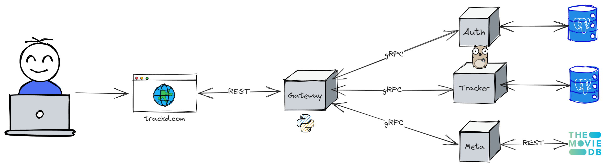

<h1 align="center">
  <a href="https://github.com/HazemKaroui/Trackd">
    
  </a>
</h1>

<div align="center">
  <h1>Trackd</h1>
  <p>A personal watch list tracking service for your movies and TV shows, built to gain familiarity with microservices and gRPC</p>
</div>

<div align="center">
<br />

[](LICENSE)
[](https://github.com/HazemKaroui/Trackd/issues?q=is%3Aissue+is%3Aopen+label%3A%22help+wanted%22)
[](https://github.com/HazemKaroui/Trackd/issues)

</div>

<details open>
<summary>Table of Contents</summary>

- [Architecture](#architecture)
  * [Auth](#auth)
  * [Tracker](#tracker)
  * [Meta](#meta)
- [Roadmap](#roadmap)
- [Run Locally](#run-locally)
  * [Set up the main service](#set-up-the-main-service)
  * [Set up the microservices](#set-up-the-microservices)
  * [Start all of the services](#start-all-of-the-services)
- [REST API Reference](#rest-api-reference)
  * [Auth](#auth-1)
    + [Create an account](#create-an-account)
    + [Login](#login)
  * [Tracker](#tracker-1)
    + [Create a tracked media item](#create-a-tracked-media-item)
    + [Get all the tracked items of a given user](#get-all-the-tracked-items-of-a-given-user)
    + [Modify a tracked media item](#modify-a-tracked-media-item)
    + [Delete a tracked media item](#delete-a-tracked-media-item)
- [License](#license)

</details>

---

## Architecture



The app is layed out into 3 Golang microservices that communicate with a Flask gateway using gRPC.
The gateway provides a REST API to be consumed by a headless webapp.

### Auth
The microservice responsible for user creation, login, and JWT token generation/validation.

### Tracker
The microservice responsible for recording and editing entries in the watch list.

### Meta
The microservice responsible for querying TMDB API and feeding movie/TV show metadata and cover images to the Tracker microservice.
## Roadmap

- Finish the JWT authentication flow
- Implement the Meta microservice
- Deploy with Kubernetes
## Run Locally

Clone the project

```bash
  git clone https://github.com/HazemKaroui/Trackd.git
```

Go to the project directory

```bash
  cd Trackd
```
### Set up the main service
- Go to the main-service directory
- Create a virtual python environment and activate it
- Install dependencies with

```bash
  pip install -r requirements.txt 
```

### Set up the microservices
- Go to each microservice directory and install dependencies with

```bash
  go get
```

### Start all of the services
- Go to the main-service directory and run it with

```bash
  python app.py
```

- Go to each microservice directory and run it with
```bash
  go run main.go
```

## REST API Reference

### Auth

<details closed">

#### Create an account

```http
  POST /auth/register
```

| Parameter | Type     | Description                |
| :-------- | :------- | :------------------------- |
| `username` | `string` | **Required**. unique username |
| `password` | `string` | **Required**. password |

#### Login

```http
  GET /auth/login
```

| Parameter | Type     | Description                |
| :-------- | :------- | :------------------------- |
| `username` | `string` | **Required**.  unique username |
| `password` | `string` | **Required**. password |

On successful login returns the user details along with a JWT token in a "token" field.
 
</details>

### Tracker

<details closed>

REST who
  
#### Create a tracked media item

```http
  POST /tracked/create
```

| Parameter | Type     | Description                |
| :-------- | :------- | :------------------------- |
| `title` | `string` | **Required**. title of the movie or show |
| `description` | `string` | short description |
| `cover` | `string` | cover image URL |
| `category` | `string` | movie or TV show |
| `genre` | `string` | genre (crime, drama, etc..) |
| `rating` | `string` | verbal rating (classic, meh, never again..) |

#### Get all the tracked items of a given user

```http
  GET /tracked/get
```

Returns a collection of the tracked items of the currently logged-in user

#### Modify a tracked media item

```http
  POST /tracked/update
```

| Parameter | Type     | Description                |
| :-------- | :------- | :------------------------- |
| `id` | `int` | **Required**. unique id of item to update |
| `title` | `string` | title of the movie or show |
| `description` | `string` | short description |
| `cover` | `string` | cover image URL |
| `category` | `string` | movie or TV show |
| `genre` | `string` | genre (crime, drama, etc..) |
| `rating` | `string` | verbal rating (classic, meh, never again..) |

#### Delete a tracked media item

```http
  POST /tracked/delete
```

| Parameter | Type     | Description                |
| :-------- | :------- | :------------------------- |
| `id` | `int` | **Required**. unique id of item to remove |
  
</details>

## License

[MIT](https://choosealicense.com/licenses/mit/)

